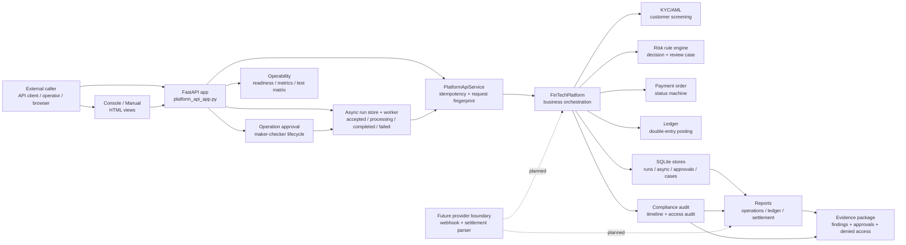

# FinTech Platform 系统结构图

这张图说明当前 `labs/fintech-platform` 在项目中的位置：它不是单纯的订单系统，而是把 KYC/AML、支付订单、风控、账本、审计、报表、审批和运维视角串起来的教学版金融业务编排平台。

## 读图要点

- `External caller` 指所有从系统外进入的调用者，包括 API client、浏览器操作员和未来的外部 provider 事件。
- `PlatformApiService` 负责把外部请求整理成内部可处理的请求，并处理 `run_id` + request fingerprint 幂等。
- `FinTechPlatform` 是主业务编排层，负责串起 KYC/AML、payment order、risk、ledger 和 audit。
- `Async` 和 `Approval` 是高影响操作的工程边界：后台任务独立推进，失败重试要先进入审批。
- `ProviderBoundary` 目前仍是计划中的缺口，用于补齐外部 payment provider、webhook 和 settlement file。
