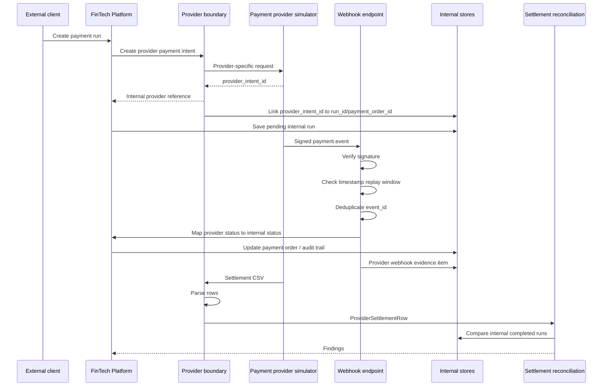

# 外部 Payment Provider 协议边界图

这张图说明后续要补的“外部”到底是什么：不是再做一个内部订单入口，而是模拟外部 payment provider / bank / clearing system 如何通过协议、webhook 和 settlement file 影响内部金融状态。

## 读图要点

- `Provider boundary` 是内部系统和第三方支付系统之间的隔离层。
- `Webhook endpoint` 不能直接相信外部请求，必须先验签，再按 `event_id` 幂等去重。
- `timestamp replay window` 用来拒绝太旧或来自明显未来的 signed payload。
- `provider status` 和内部 `payment order status` 不是同一个状态机，需要显式映射。
- `provider_intent_id` 是外部支付对象和内部 `run_id` / `payment_order_id` 的关联键。
- `Settlement CSV` 用来模拟外部结算文件，检查内部成功记录是否真的能和外部结算记录对上。

## 当前项目状态

当前项目已经有：

- 内部 payment run。
- async worker。
- retry approval。
- ledger reconciliation。
- teaching version `ProviderSettlementRow`。
- settlement reconciliation report。
- 教学版 provider intent。
- 教学版 webhook 签名和验签。
- 教学版 `POST /platform/provider-webhooks` endpoint。
- 教学版 timestamp tolerance / replay window。
- webhook event 去重和状态映射。
- provider intent link CSV。
- settlement CSV parser。
- demo 中的 provider settlement CSV 文件解析和 settlement reconciliation report。
- provider webhook evidence item。

当前仍未实现：

- 真实生产级 HTTP webhook endpoint。
- 真实 provider adapter。
- 真实密钥管理。
- 将 provider webhook 自动接入现有主支付流程。

这些缺口可以先作为教学版实现，不绑定真实 Stripe、PayPal、Visa 或银行接口。若后续引用真实 API，必须查证官方开发者文档。
