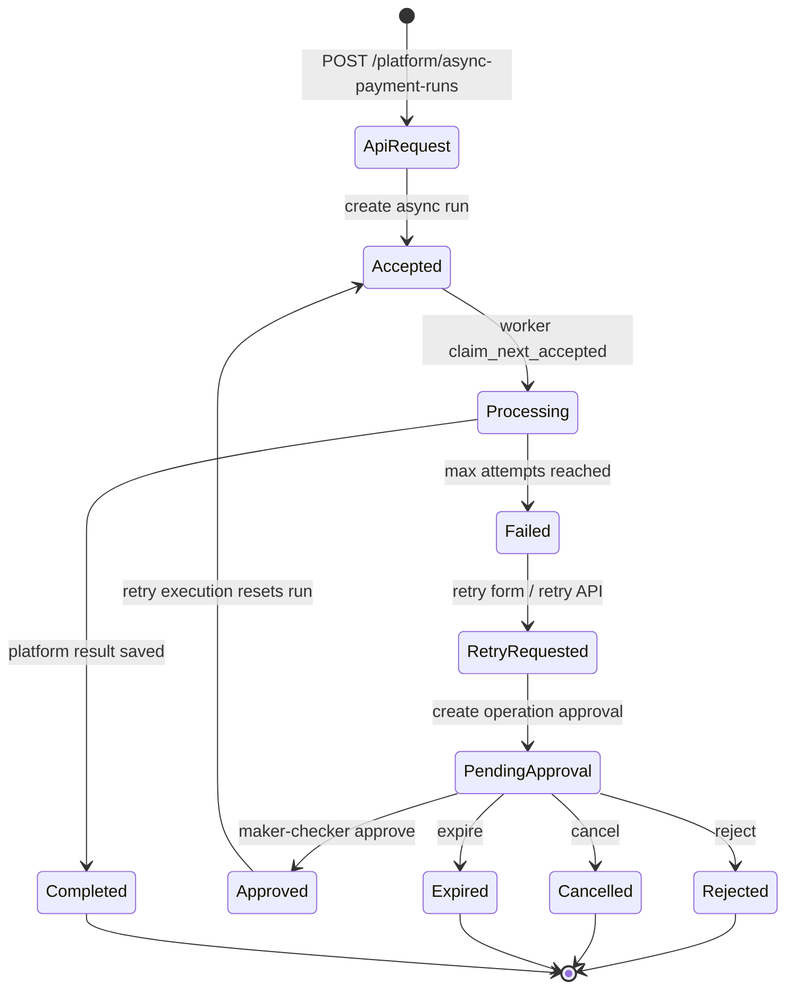

# Payment Run 生命周期图

这张图说明当前平台如何处理一笔 payment run，尤其是异步任务、失败重试和 operation approval 的关系。

## 读图要点

- API 创建 async run 后，业务还没有完成，只是进入 `accepted`。
- worker 用 `claim_next_accepted()` 认领任务，避免重复 worker 同时处理同一条 run。
- `failed` 不能直接重试，必须先创建 `pending` operation approval。
- approval 通过后才执行 retry，把 failed run 放回 `accepted`。
- approval 被 reject、cancel 或 expire 时，不执行 retry。

## 和普通后端系统的区别

普通后端系统常见逻辑是“失败就点按钮重试”。FinTech 系统里，高影响操作需要回答：

- 谁申请 retry？
- 谁审批 retry？
- 审批原因是什么？
- 是否存在自审批？
- retry 是否真的执行？
- 失败和拒绝是否都留下 audit trail？

这就是 `operation approval` 和 `access audit` 的价值。
