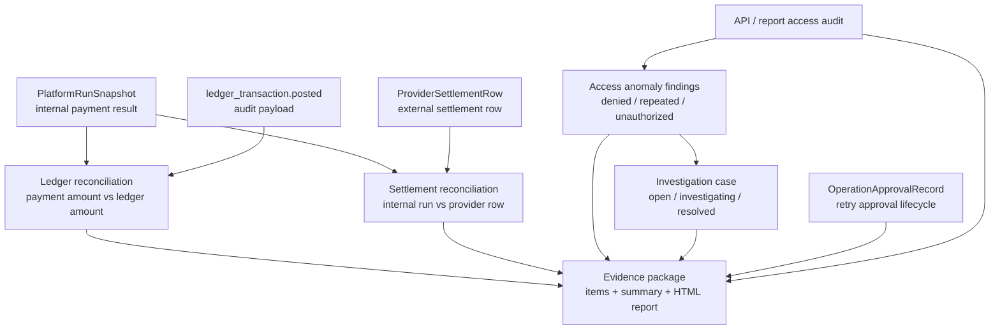

# 对账与 Evidence Package 流程图

这张图说明平台如何把内部运行记录、账本证据、外部 settlement row、访问异常和审批记录汇总成可复核的材料。

## 读图要点

- `Ledger reconciliation` 看内部业务结果和账本入账是否互相解释得通。
- `Settlement reconciliation` 看内部 completed run 是否能和外部 provider settlement row 对上。
- `Access anomaly` 把访问审计里的异常行为变成 finding。
- `Investigation case` 把 finding 变成可处理的工单。
- `Evidence package` 把对账差异、访问异常、审批记录和拒绝访问事件整理成可复核材料。

## 教学边界

当前 evidence package 只是教学版：

- 不代表真实法律保全。
- 不代表真实监管证据清单。
- 不代表 WORM 存储。
- 不代表电子签名或证据链 custody。
- 不定义真实留存期限。

如果未来要接近真实合规要求，需要先查证监管、法律、审计和公司内部治理规则。
